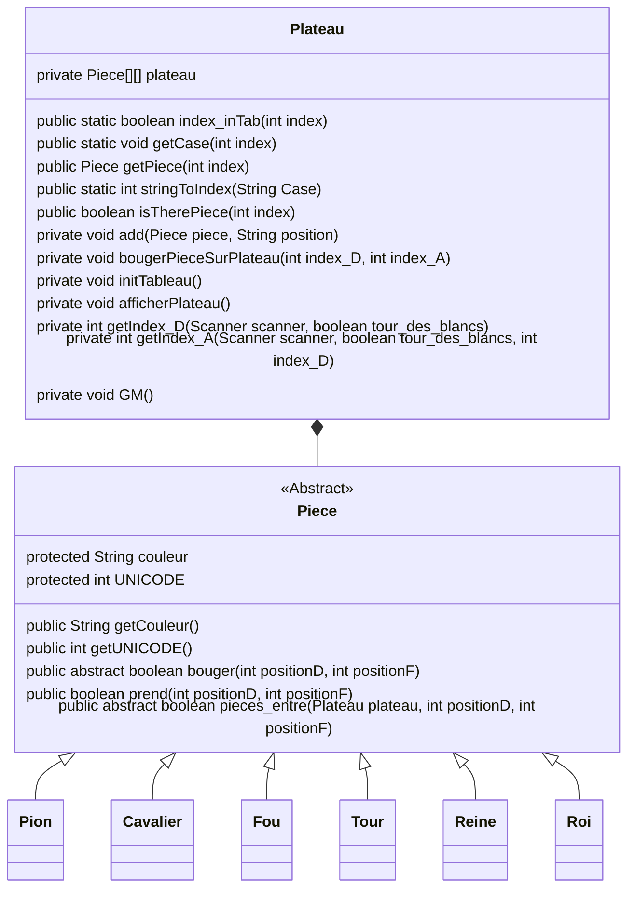
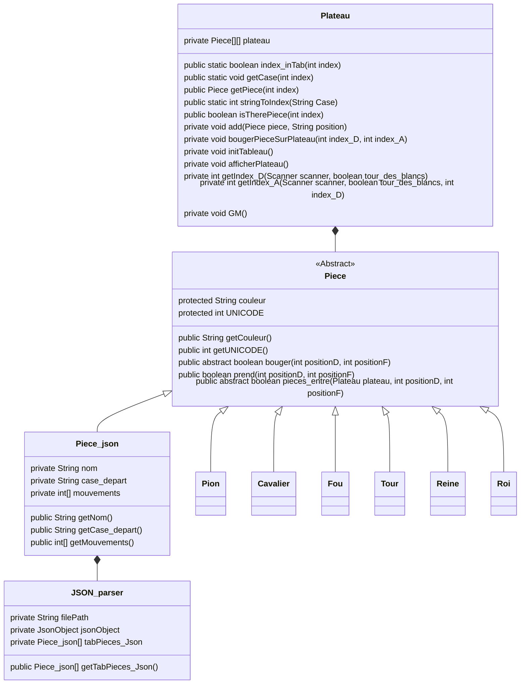

## 1 - Documentation
Le fonctionnement de chaque méthode est décrite avant sa déclaration. 
### Schéma
#### Partie 1

#### Partie 2


## 2 - Structure des fichiers
#### Avant compilation
```
.
├── build.xml
├── config
│   └── config.json
├── jeu
│   ├── Cavalier.java
│   ├── Fou.java
│   ├── JSON_parser.java
│   ├── Piece.java
│   ├── Piece_json.java
│   ├── Pion.java
│   ├── Plateau.java
│   ├── Reine.java
│   ├── Roi.java
│   └── Tour.java
├── lib
│   └── gson-2.10.1.jar
└── README.md
```

#### Après compilation
```
.
├── build.xml
├── class
│   └── jeu
│       ├── Cavalier.class
│       ├── Fou.class
│       ├── JSON_parser.class
│       ├── Piece.class
│       ├── Piece_json.class
│       ├── Pion.class
│       ├── Plateau.class
│       ├── Reine.class
│       ├── Roi.class
│       └── Tour.class
├── config
│   └── config.json
├── jeu
│   ├── Cavalier.java
│   ├── Fou.java
│   ├── JSON_parser.java
│   ├── Piece.java
│   ├── Piece_json.java
│   ├── Pion.java
│   ├── Plateau.java
│   ├── Reine.java
│   ├── Roi.java
│   └── Tour.java
├── lib
│   └── gson-2.10.1.jar
└── README.md
```

## 3 - Compilation et lancement
### Lancer directement la partie d’Échecs
Par défaut ant compile et lance la partie d’Échecs
```bash
ant
```

### Compilation
Pour compiler le projet il suffit d'utiliser ant avec la cible : "Compiler"
```bash
ant Compile
```
Pour créer une archive jar, il suffit d'utiliser ant avec la cible : "jar" (Cette archive sera executable)
```bash
ant jar
```

### Lancer le programme
Pour lancer le programme  il suffit d'utiliser ant avec la cible : "Run"
```bash
ant Run
```
Pour le lancer sans l'aide de ant, la classe principale est **jeu.Plateau**


## 4 - Version des différents outils utilisés
#### ANT
Version utilisée : Apache Ant(TM) version 1.10.14

#### Gson
Version utilisée : gson-2.10.1

#### java
Version utilisée : 21.0.10
